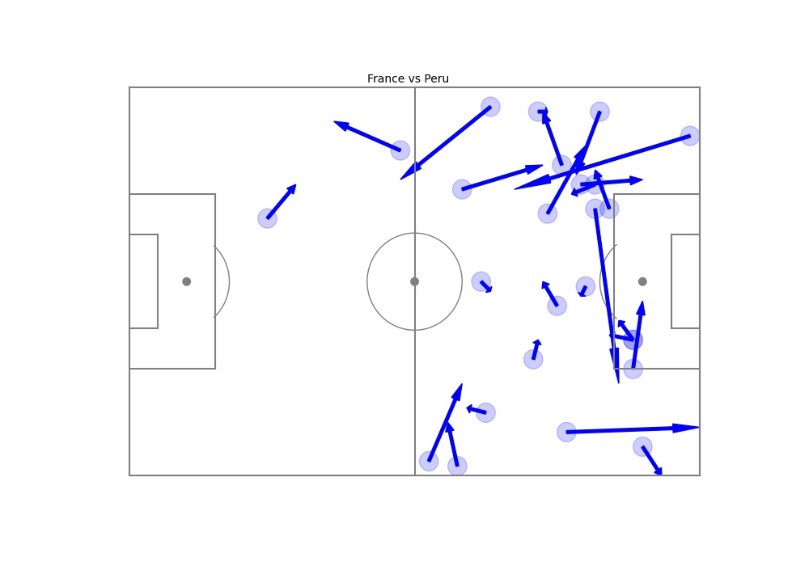
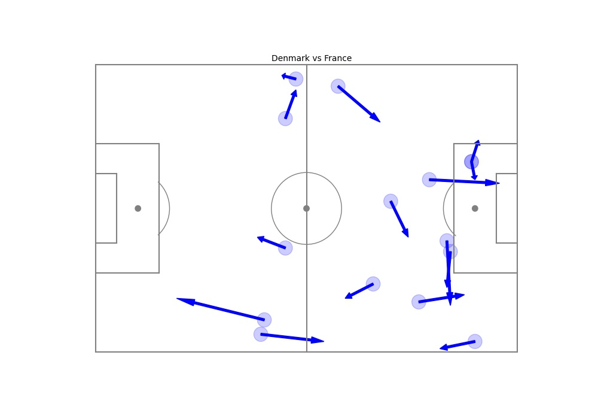
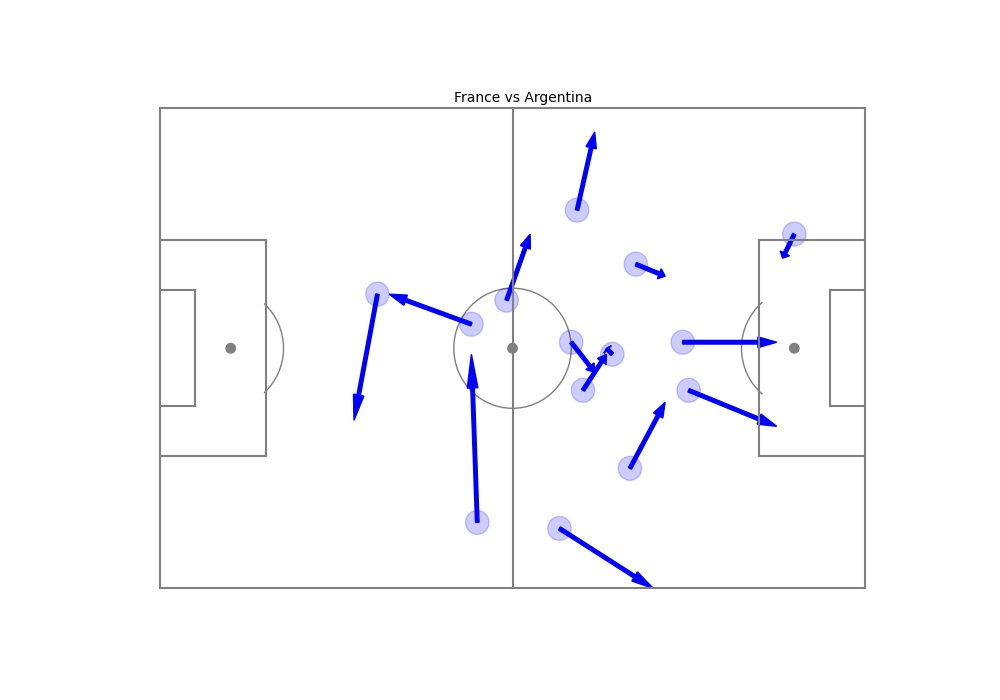
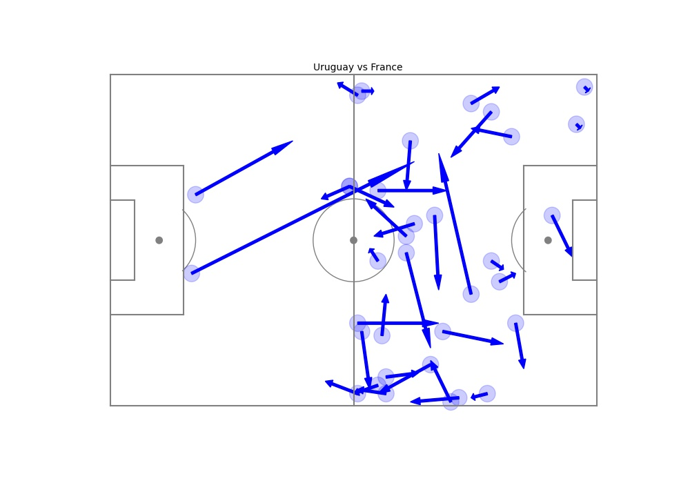
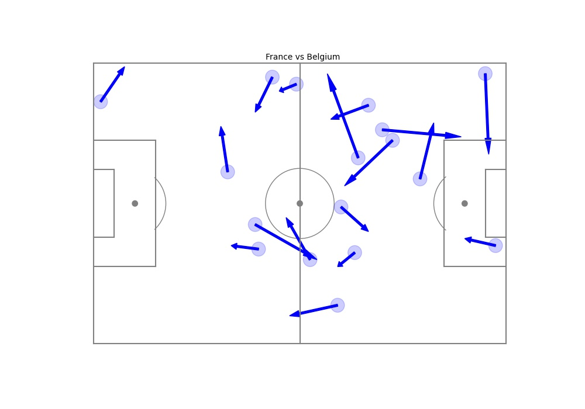

## Olivier Giroud's pass map during World Cup 2018 

### Result

In first match vs Australia, Giroud enter the field during 70th minute. It is clearly shown that he get no chance to receive ball. This also was the affect from poor performance from France in opening game during World Cup 2018. 

In this match, Giroud play full time for France. The match ended with France take 3 points resulting from Mbappe's strike that assisted by Giroud. 

During this match, Giroud listed in starting squad but with France B team. The result ended with goalless draw. In this match, we can see Giroud's involvement was lacking compared to previous game.
 

In this match, Giroud was asked to drop deep in midfield area to nullify Belgium's attack based on Deschamps. I think that's why compared to previous match, Giroud was positioned to stay low than receive more ball from teammates. 

I think the stat in this match shown the same tactical used for Giroud. Despite that, he clearly more involved in one side area. 

### Data from
